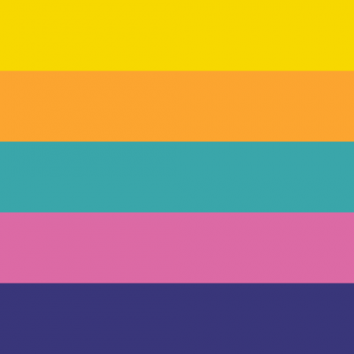

# Project Conclave - A Video Game Item Collection Tracker and Dependency Explorer

> _con·​clave_, noun, from Latin _con_ ("with") + _claves_ ("keys")

Item tracker for a number of games, vanilla and randomized.

Please report any issues you may find [on Github!](https://github.com/mileswest07/project-conclave/issues)

## Item Tracker instructions

Left and right clicks will toggle the icons. For standalone items, this will activate and deactivate them. For numbered counters, left click will increment and right click with decrement the numbers.

Some items will have "progressive upgrades" or milestones after activation; these are depicted by up and down arrows on the side of the image. Left click will upgrade the item, and right click will downgrade. Some items have multiple progression stages.

Middle click, if you have it, will toggle some overlaid icons, depending on the game and the item. For some icons this will display a sub-icon marking the collection of a hint or triggering of item collection event at the specified location. For select few items, this will toggle the item with a secondary form of that item (depicted by a ? icon).

Upon loading of the page, you can specify the configurations you'd like to use for tracking. Clicking the Ready button will generate a new page where those settings are saved to the address bar, so you can copy-and-paste the URL for loading in your browser at any time. (Note that at this time, the actual tracking of items are not saved locally; refreshing the browser will lose your progress! This will be addressed in the near future.)

Configuration options include the ability to display a timer and item collection percentages. Clicking on the timer will start it and stop it. The Reset button will clear it. (This option is currently disabled if Randomizer Mode is selected, and will be restored in the near future.)

The option for Randomizer Mode will display a table of games for selection. This consolidates randomizers with crossrandomizers and multiworld tracking. Select which games you'd like to track manually, or select from a few presets.

There are three graphical styles available for Metroid games, and one for Zelda games, at this time. This may change in the future.

### Games currently trackable

Trademarked titles:

- The Legend of Zelda (NES)
- Metroid (NES)
- Zelda II: The Adventure of Link (NES)
- Metroid II: Return of Samus (GB)
- The Legend of Zelda: A Link to the Past (SNES)
- Super Metroid (SNES)
- Castlevania: Symphony of the Night (PSX)
- Metroid: Fusion (GBA)
- Metroid Prime (GCN)
- Metroid: Zero Mission (GBA)
- Metroid Prime 2: Echoes (GCN)
- Metroid Prime Pinball (NDS)
- Metroid Prime: Hunters (NDS)
- Metroid Prime 3: Corruption (Wii)
- Metroid: Other M (Wii)
- Metroid Prime: Federation Force (3DS)
- Metroid: Samus Returns (3DS)
- Metroid: Dread (Switch)
- Metroid Prime 4: Beyond (Switch)

Fangames and notable ROMhacks:

- Metroid Confrontation (by DoctorM64)
- AM2R (by DoctorM64)
- Rogue Dawn (ROMhack of Metroid NES)
- Metroid: A New Galaxy (by u/Kelly_Crystal)
- Metroid: The Threat Never Ends (by u/Kelly_Crystal)
- Prime 2D (by Team SCU)
- ZIIAOL (by Hoverbat)

Randomizers, Multiworlds, and Crossrandomizers:

- ALTTPR (by ALTTPR team)
- Randovania (by Randovania team)
- Z1M1 (by Metalmachine and team)
- SMZ3 (by tewtal and team)

## Dependency Explorer

Currently not ready for use, and has been disabled. This is intended to be the next major upgrade of the tracker.

## Development

This project is meant to run on an internet browser. So far the tested browsers include Firefox and Chrome. Styling issues can be submitted as tickets and will be addressed accordingly.

This platform reads a JSON file local to the server. To test it locally, make sure Node, NPM, and NPX are globally installed, then simply spin up a local server using:

```
$ npx http-server --proxy http://localhost:8080
```

In order to circumvent this, some code may be necessarily refactored in order to read `rawData.js` as an imported JS file, instead. It is recommended to sync changes between `rawdata.json` and `rawData.js` before submitting to main branch.

## Credits

Code was all written by me. All assets and code may be used for non-profit purposes; I merely ask that correct credit be given to responsible parties for it.

* Rogue Dawn graphics: Grimlock, Optomon, snarfblam and team
* Metroid: A New Galaxy: u/Kelly_Crystal
* Metroid: The Threat Never Ends: also u/Kelly_Crystal
* Prime2D: Team SCU
* Z1M1: Metalmachine and team
* SMZ3: tewtal and team
* Randovania: Darkszero and team
* AM2R: DoctorM64, team, and continuation team
* ZIIAOL: HoverBat and team
* All randomizers: their respective teams

All Metroid game graphics (with exception of fangames and derivative works) and Zelda Minish Cap graphics were made and owned by Nintendo Co., Ltd., Mercury Steam Entertainment S.L., and Capcom Co., Ltd., respectively. Graphics were ripped by me, and are used here without express permission and without intent to profit.

All Castlevania: Symphony of the Night game graphics were made and owned by Konami Group Corporation. Graphics were ripped by online contributors, and are used here without express permission and without intent to profit.

Rogue Dawn graphics were made by the Rogue Dawn creators, ripped by me, and are used here without express permission and without intent to profit.

AM2R graphics were made by the AM2R continuation team, ripped by me, and are used here without express permission and without intent to profit.

Prime 2D graphics were made by Team SCU, ripped by me (admittedly not very cleanly), and are used here without express permission and without intent to profit.

All custom-made Metroid: Zero Mission-style sprites were custom-made by Miles07 and Ridleymaster, intending to mimic or approximate an officially-owned graphical style (i.e. Nintendo's Metroid: Zero Mission graphical style) without intent to profit. The sprite sheet in its fullest is publicly available on the Spriter's Resource website.

All colorblind-mode Metroid placeholder icons were custom-made or kitbashed by me, intending to mimic or approximate an officially-owned graphical style (i.e. Nintendo's Metroid: Other M graphical style) without intent to profit.

Remainder Zelda graphics were custom-made or kitbashed by me, intending to mimic or approximate an officially-owned graphical style (i.e. Nintendo's Zelda Minish Cap graphical style) without intent to profit.


In loving memory of SpaghettiToastBook, who left such a great impact in the Metroid community, and whose original tracker inspired the first iteration of this project. We miss your light.


